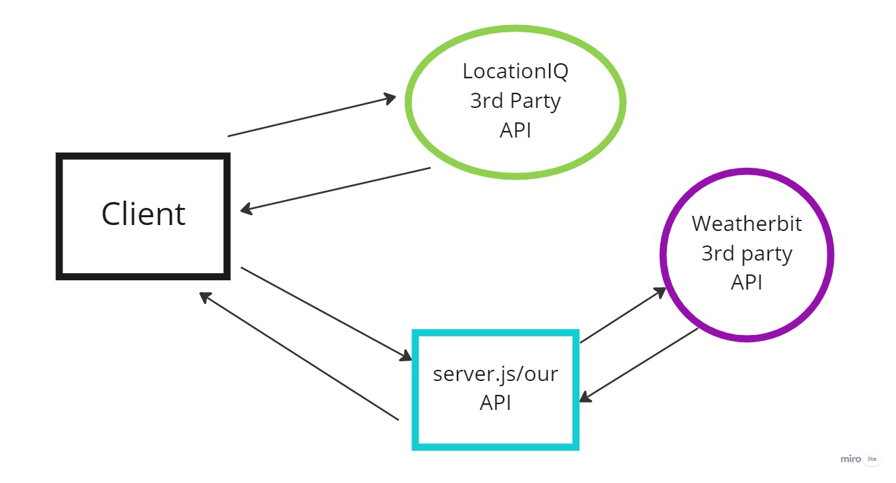
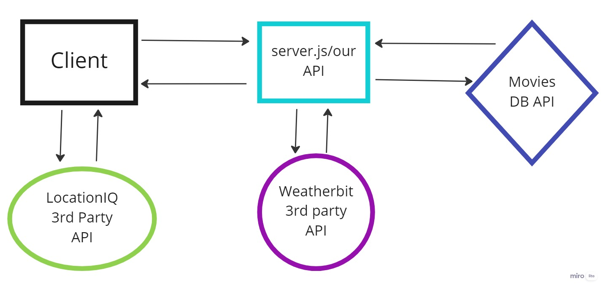
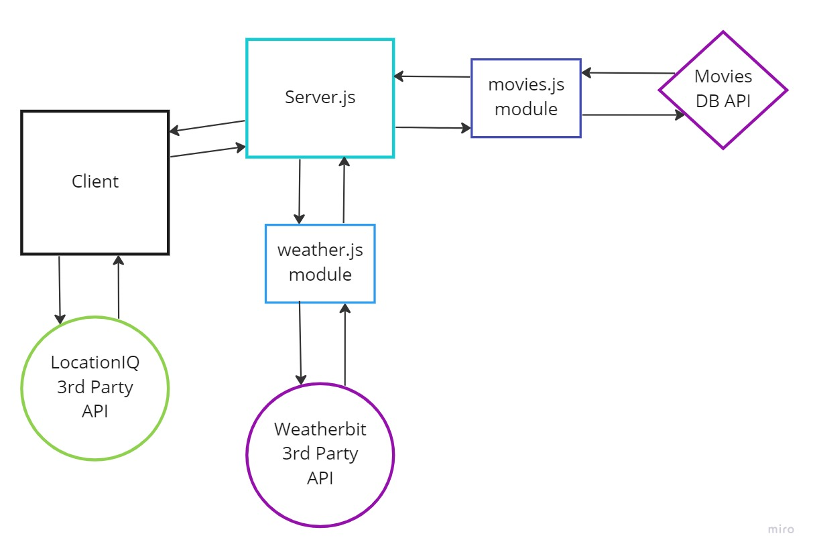
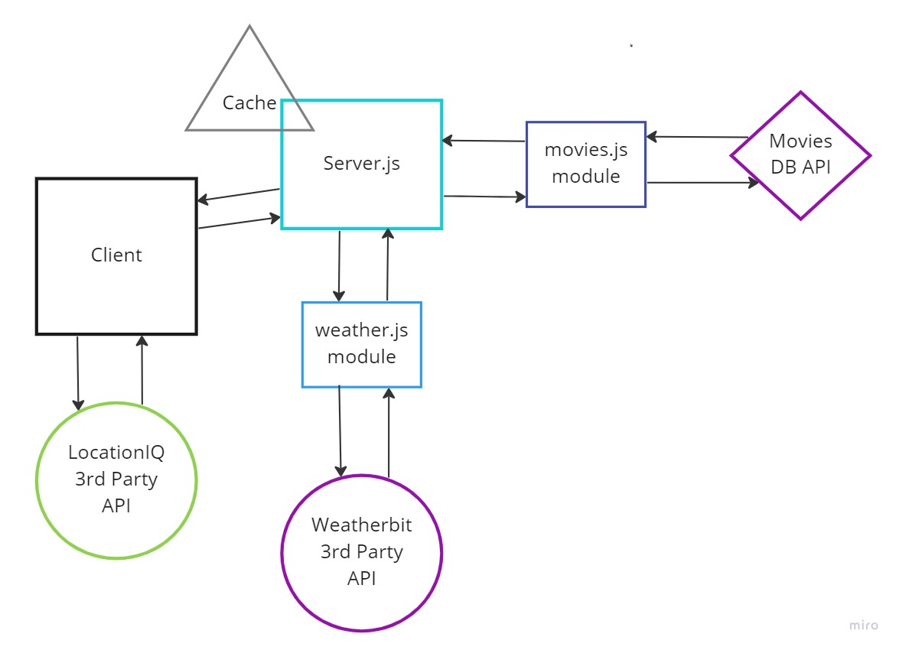

# city-explorer-api

**Author**: Steve Gant
**Version**: 1.0.0

## Overview

In this lab assignment, you will begin building your own custom API server, which will provide data for the City Explorer front-end application. This means users will get to see not only the map, but also interesting information about the area, provided by a variety of third-party APIs that your server will manage.

## Getting Started

Create a new repo called `city-explorer-api` on GitHub, initialized with a README file. Clone it locally, and do all your work on a meaningfully-named feature branch off of `main`.
Use `npm install` to add the required dependencies to this project: `express`, `dotenv`, and `cors`.
Manually add the remaining files identified in the folder tree above. Put appropriate content into `.gitignore` and `.eslintrc.json`.

## Architecture

VSCode, JS, Express, dotenv, cors, HTML, React, NodeJS,

## Change Log
<!-- Use this area to document the iterative changes made to your application as each feature is successfully implemented. Use time stamps. Here's an example:

01-01-2001 4:59pm - Application now has a fully-functional express server, with a GET route for the location resource. -->

## Credit and Collaborations

Collabed with Marco Villafana

- Estimate of time needed to complete: 3 hours

- Start time: 1500

- Finish time: 2200

- Actual time needed to complete: 7 hours

## Lab08 - Movies and Weather API

Estimate of time needed to complete: 3 hours

Start time: 1400

Finish time: 1930

Actual time needed to complete: 5.5 hours

## Lab09 - Refactoring into Modules

Estimate of time needed to complete: 2 hours

Start time: 1345

Finish time: 1800

Actual time needed to complete: 4 hr, 15 min

## Lab10 - Performance/Cache

Estimate of time needed to complete: 2 hours

Start time: 1330

Finish time: 1800

Actual time needed to complete: 4 hr, 15 min

